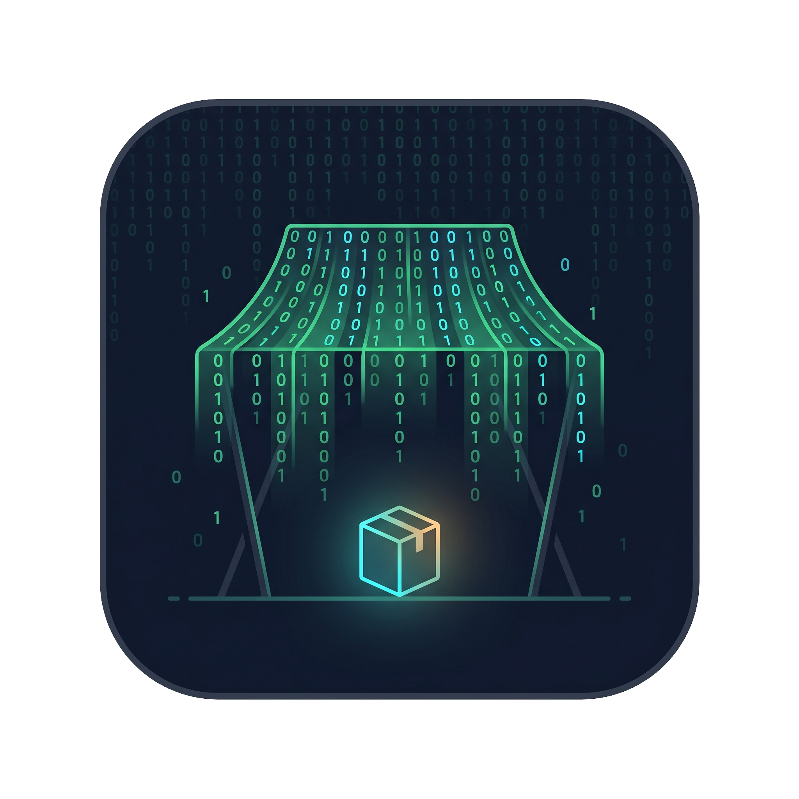

<p align="center">
  
</p>

#  Binzaar

> **bin** (binary) + ba**zaar** (market) — a tiny local marketplace that trades release binaries.

**Binzaar** is a single-binary, local "app store" for Go micro-apps. It browses a GitHub-hosted
catalog, installs the right release binary for your OS/architecture with SHA-256 verification, and
tracks, updates, re-verifies, and uninstalls what you've installed — plus scaffolds new micro-apps
from templates and can drop an embedded Claude Code starter kit into any directory
(`binzaar init`).

One shared domain, three faces:

- a **tview terminal UI** for interactive browsing and management,
- an **MCP stdio server** so LLM clients can drive the same use-cases,
- an **embedded bbolt database** — no server, no cgo, just one local data file.

Binzaar is online-only — the catalog is always fetched live; only your installs and the app's own
config are persisted. See [`docs/SPECIFICATIONS.md`](docs/SPECIFICATIONS.md) for the full product
contract.

## Concept

- **Standalone micro-app, shipped as one binary.** A single executable that runs completely locally
  — no daemon, no second process required to function. (The one opt-in exception: `serve-catalog`
  runs a minimal foreground HTTP server for hosting a custom registry.)
- **No SaaS, no accounts, no backend.** Everything lives on your machine; the only persistence is a
  local embedded database (bbolt) holding your installs and config. Your data never leaves the box.
- **Full MCP support.** Every use-case is exposed over an MCP stdio server, so an LLM client can
  browse, install, update, verify, and scaffold on your behalf — the exact same surface the TUI uses.
- **Terminal-native.** A tview TUI gives you interactive browse-and-manage entirely in your shell;
  no GUI, no browser.
- **One domain, three faces.** TUI · MCP · embedded bbolt all sit over a single use-case layer, so
  the human and the LLM drive identical behavior.
- **Trust by default.** Installs match your host `GOOS/GOARCH` automatically and are **SHA-256
  verified** against the release's checksums before anything lands on disk; unverifiable assets are
  refused unless you explicitly allow them.
- **Online-only, GitHub-backed.** Every binary/tarball comes live from GitHub — outbound HTTPS
  client I/O only (like `git` or `go install`). The catalog itself is fetched from the configured
  registry URL (the default registry by default, or any custom one).
- **Custom registries.** `binzaar serve-catalog` serves a local `catalog.json` over HTTP so a team
  can host its own registry; point another binzaar's manifest URL at it to consume it.
- **Self-hosting.** Binzaar lists itself in the catalog, so it installs and updates itself alongside
  the apps it manages.
- **A forge, not just a shelf.** Scaffold brand-new micro-apps from catalog templates and hand off
  to the spec-driven `/product-idea` workflow, or drop the embedded Claude Code kit into any
  directory with `binzaar init`.
- **Self-growing via Claude Code.** Binzaar doesn't only distribute apps — it grows the catalog.
  Scaffolding initiates an application with Claude Code's spec-driven workflow
  (`/product-idea` → `/app-init` → `/app-spec-sync`), so each new micro-app is born in the same
  shape, specified before it's built, and can be published back to the marketplace it came from —
  the store expands itself.
- **Spec is the contract.** `docs/SPECIFICATIONS.md` defines observable behavior; code and spec
  change together.

## Install

```sh
curl -fsSL https://raw.githubusercontent.com/Techthos/binzaar/refs/heads/main/scripts/install.sh | bash
```

The installer detects your OS/arch, downloads the latest release binary, verifies its SHA-256
against the `.sha256` sidecar, and installs it as `store` into
`~/.local/share/binzaar/bin` (warning if that directory is not on your `PATH`).

Environment overrides:

| Variable | Default | Purpose |
|---|---|---|
| `BINZAAR_VERSION` | `latest` | Release tag to install (e.g. `v0.2.0`) |
| `BINZAAR_INSTALL_DIR` | `~/.local/share/binzaar/bin` | Target directory |
| `BINZAAR_REPO` | `Techthos/binzaar` | `owner/name` to install from |
| `BINZAAR_GITHUB_TOKEN` | — | Token for private repos / higher rate limits (`GITHUB_TOKEN` also honored) |

## Prerequisites

- **Go** (toolchain that satisfies `go.mod`).
- Optional, for `make fmt` / `make lint`:
  ```sh
  go install mvdan.cc/gofumpt@latest
  go install github.com/golangci/golangci-lint/v2/cmd/golangci-lint@latest
  ```
  `make` reports which are missing rather than failing silently.

## Getting started

```sh
make build    # go build -o bin/binzaar .
make run      # go run .
make test     # go test ./... -race -cover
make fmt      # gofumpt -w .
make lint     # golangci-lint run
make tidy     # go mod tidy
make check    # fmt + tidy + lint + test, in sequence
```

Run a single test:

```sh
go test ./... -run TestName -race -v
```

## Usage

```sh
binzaar                # terminal UI (default; `binzaar tui` is equivalent)
binzaar mcp            # MCP stdio server for LLM clients
binzaar serve-catalog  # serve ./catalog.json over HTTP on :8080 (custom registry)
binzaar serve-catalog --catalog /path/to/catalog.json --addr :9090
binzaar init           # drop the embedded Claude Code starter kit into the current directory
```

`--db <path>` overrides the database location for the `tui` and `mcp` modes
(default `~/.local/share/binzaar/binzaar.db`). `serve-catalog` validates the catalog file at
startup, re-reads it on every request (edits show up without a restart), and needs neither the
database nor GitHub.

## Configuration

- `BINZAAR_GITHUB_TOKEN` — optional GitHub token; raises rate limits and enables private repos.
  Anonymous access is used when unset.

## Layout

This repo starts flat (`main.go`) and grows `internal/` packages as the spec is implemented:

```
models  ←  db  ←  server
            ↑
           tui
```

`internal/models` is storage-agnostic; `internal/db` is the only package that touches bbolt; both
`internal/server` (MCP) and `internal/tui` go through `internal/db`. See `CLAUDE.md` and
`.claude/rules/` for the layer rules.

---

Built and maintained by [Techthos](https://www.techthos.net).
